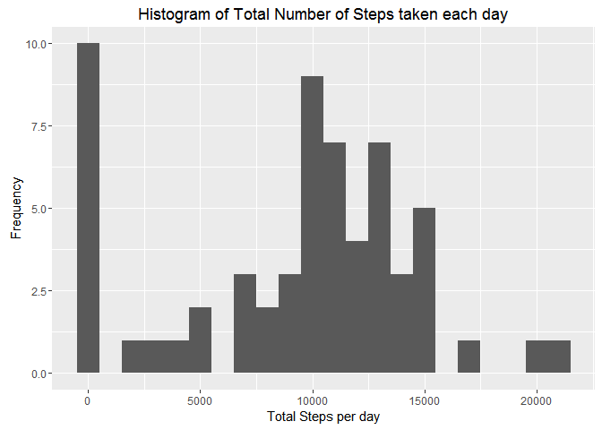
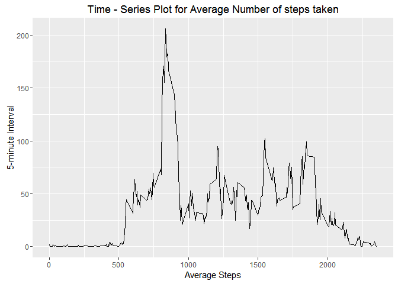
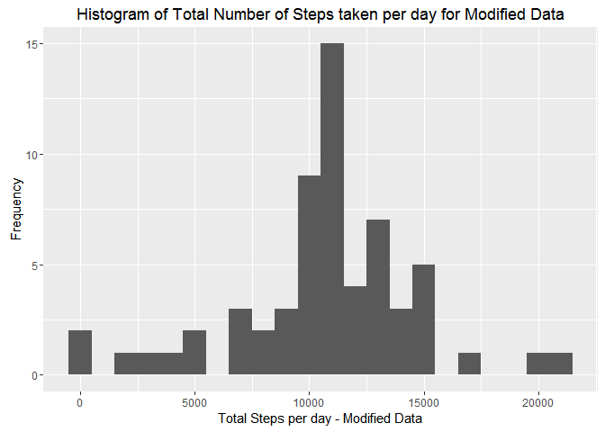
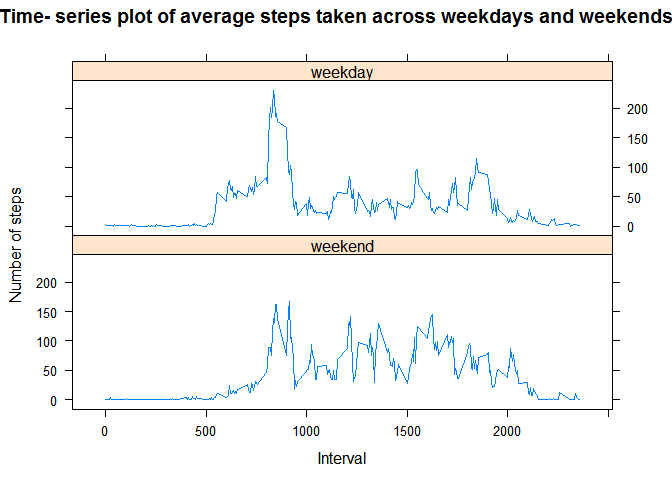

# Reproducible Research: Peer Assessment 1
Akshaya  
September 7, 2016  


## Introduction
This assignment makes use of data from a personal activity monitoring device. This device collects data at 5 minute intervals through out the day. The data consists of two months of data from an anonymous individual collected during the months of October and November, 2012 and include the number of steps taken in 5 minute intervals each day.

The data for this assignment can be downloaded from the course web site:

Dataset: Activity monitoring data [52K]
The variables included in this dataset are:

steps: Number of steps taking in a 5-minute interval (missing values are coded as NA)
date: The date on which the measurement was taken in YYYY-MM-DD format
interval: Identifier for the 5-minute interval in which measurement was taken


##Loading and preprocessing the data

```r
## 1. Code for reading in the dataset and/or processing the data

library(ggplot2)
```

```
## Warning: package 'ggplot2' was built under R version 3.3.1
```

```r
library(Hmisc)
```

```
## Warning: package 'Hmisc' was built under R version 3.3.1
```

```
## Loading required package: lattice
```

```
## Loading required package: survival
```

```
## Warning: package 'survival' was built under R version 3.3.1
```

```
## Loading required package: Formula
```

```
## 
## Attaching package: 'Hmisc'
```

```
## The following objects are masked from 'package:base':
## 
##     format.pval, round.POSIXt, trunc.POSIXt, units
```

```r
if(!file.exists("./data")){
  dir.create("./data")
}

url="https://d396qusza40orc.cloudfront.net/repdata%2Fdata%2Factivity.zip"
download.file(url,dest="./data/Factivity.zip")
unzip(zipfile = "./data/Factivity.zip",exdir = "./data")
activity<-read.csv("./data/activity.csv")


totalSteps<-with(activity,tapply(steps,date,sum,na.rm=TRUE))
dailySteps<-as.data.frame(totalSteps)
```

## What is mean total number of steps taken per day?
 1.Make a histogram of the total number of steps taken each day
 2.Calculate and report the mean and median of total number of steps taken per day


```r
# 2. Plotting the histogram of Total Number of Steps taken each day
ggplot(dailySteps,aes(x=totalSteps))+
  geom_histogram(binwidth=1000) +
  labs(title = "Histogram of Total Number of Steps taken each day", x = "Total Steps per day", y = "Frequency")
```

<!-- -->


```r
# 3. Mean and Median of Total steps per day
meanSteps <- mean(totalSteps,na.rm = TRUE)
medianSteps <- median(totalSteps,na.rm = TRUE)
```
The mean of the total number of steps taken per day is 9354.2295082.
The median of the total number of steps taken per day is 10395.

## What is the average daily activity pattern?

 1.Make a time series plot (i.e. type = "l") of the 5-minute interval (x-axis) and the average number of steps taken, averaged across all days (y-axis)

 2.Which 5-minute interval, on average across all the days in the dataset, contains the maximum number of steps?


```r
# 4. Time-Series plot for average number of steps taken
dailyaverageSteps<-with(activity,tapply(steps,interval,mean,na.rm=TRUE))

dailyaverageStepsTime <- data.frame(interval=as.integer(names(dailyaverageSteps)), avgStep=dailyaverageSteps)


figure<-ggplot(dailyaverageStepsTime,aes(x=interval,y=avgStep))+geom_line()+ labs(title = "Time - Series Plot for Average Number of steps taken",x ="Average Steps", y ="5-minute Interval") 
print(figure)
```

<!-- -->


```r
# 5.Maximum Steps in the Average in the 5-minute interval
maximumSteps<-dailyaverageStepsTime[which.max(dailyaverageStepsTime$avgStep),]
maxInterval<-maximumSteps["interval"]
```
The 5-minute interval , on average across all the days in the dataset that contains the maximum steps is
835.

## Imputing missing values

 1. Calculate and report the total number of missing values in the dataset (i.e. the total number of rows with NAs)

 2. Create a new dataset that is equal to the original dataset but with the missing data filled in.

 3. Make a histogram of the total number of steps taken each day and Calculate and report the mean and median total number of steps taken per day.


```r
#6.Code to describe and show a strategy for imputing missing data
missingData<-sum(is.na(activity$steps)) 

modifiedactivity<-activity

missingRows<-is.na(modifiedactivity$steps)

modifiedactivity[missingRows,c("interval","steps")]<-dailyaverageStepsTime[as.character(modifiedactivity$interval[missingRows]),]

missingImputedData<-sum(is.na(modifiedactivity$steps)) 
missingImputedData
```

```
## [1] 0
```
The total number of missing values in the dataset - 2304.


```r
# 7.Histogram of the total number of steps taken each day after missing values are imputed

totalImputedSteps<-with(modifiedactivity,tapply(steps,date,sum,na.rm=TRUE))
dailyImputedSteps<-as.data.frame(totalImputedSteps)


ggplot(dailyImputedSteps,aes(x=totalImputedSteps))+
  geom_histogram(binwidth=1000) +
  labs(title = "Histogram of Total Number of Steps taken per day for Modified Data", x = "Total Steps per day - Modified Data", y = "Frequency")
```

<!-- -->

```r
meanImputedSteps <- mean(totalImputedSteps,na.rm = TRUE)
medianImputedSteps <- median(totalImputedSteps,na.rm = TRUE)
```
The mean of total number of steps taken per day (imputed missing data) is 1.0766189\times 10^{4}.
The median of total number of steps taken per day (imputed missing data) is 1.0766189\times 10^{4}


The values of mean and median differ from the estimates from the first part of the assignment(without the missing data).The impact of imputing missing data on the estimates of the total daily number of steps - **mean and median remains the same for imputed missing data**.

## Are there differences in activity patterns between weekdays and weekends?

 1.Create a new factor variable in the dataset with two levels -- "weekday" and "weekend" indicating whether a given date is a weekday or weekend day.

 2.Make a panel plot containing a time series plot (i.e. type = "l") of the 5-minute interval (x-axis) and the average number of steps taken, averaged across all weekday days or weekend days (y-axis). 


```r
#8. Panel plot comparing the average number of steps taken per 5-minute interval across weekdays and weekends 

#Differences in activity patterns between weekdays and weekends

modifiedactivity$date <- as.Date(modifiedactivity$date)

#create a vector of weekdays
weekdays1 <- c('Monday', 'Tuesday', 'Wednesday', 'Thursday', 'Friday')

#convert to `factor` and specify the `levels/labels`
modifiedactivity$dayType <- factor((weekdays(modifiedactivity$date) %in% weekdays1), 
                                   levels=c(FALSE, TRUE), labels=c('weekend', 'weekday'))

# Panel plot

dailyaverageImputedSteps<-aggregate(steps~dayType +interval,modifiedactivity,FUN = mean)

dailyaverageImputedSteps <- data.frame(dailyaverageImputedSteps)

xyplot(steps~interval|dayType,dailyaverageImputedSteps,type="l" , main ="Time- series plot of average steps taken across weekdays and weekends", xlab = "Interval", ylab = "Number of steps",layout=c(1,2))
```

<!-- -->
##The activity is higher in the inital intervals on weekdays than on weekends and the activity is more throughout the intervals on weekends than on weekdays.

